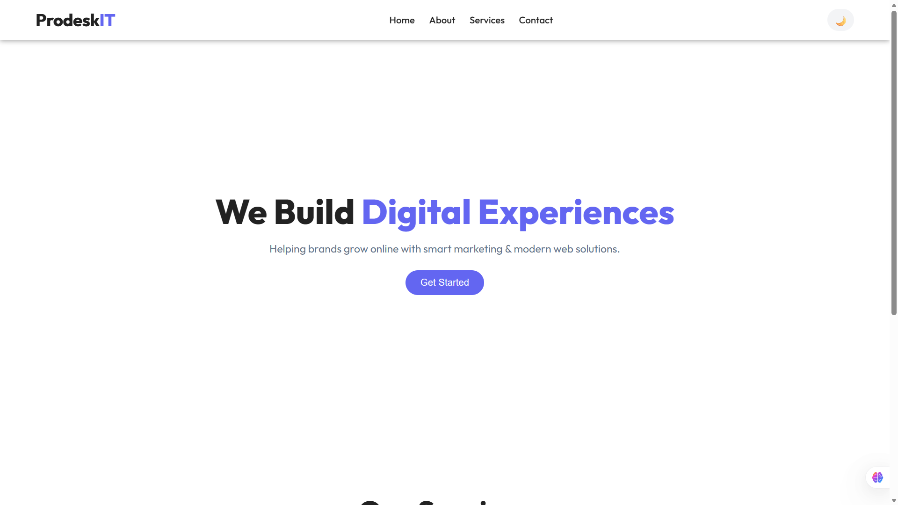

# Prodesk IT - Digital Marketing Agency

Welcome to the **Prodesk IT** project repository. This is a responsive, modern single-page website for a digital marketing agency, featuring a clean design, dark mode, and mobile responsiveness.


.png)


## 🚀 Features

- **Responsive Design**: Fully adaptable layout for mobile, tablet, and desktop screens.
- **Dark Mode**: Built-in toggle to switch between light and dark themes.
- **Modern UI**: Uses the "Outfit" font, smooth transitions, and a clean color palette.
- **Service Cards**: Highlighted services with hover effects.
- **Mobile Navigation**: Hamburger menu for smaller screens.

## 🛠️ Technology Stack

- **HTML5**: Semantic markup for structure.
- **CSS3**: comprehensive styling with CSS Variables (Custom Properties), Flexbox, and CSS Grid.
- **JavaScript**: Simple DOM manipulation for interactive features like the mobile menu and theme toggle.
- **Fonts**: Google Fonts (Outfit).

## 📂 File Structure

- `index.html`: The main structure of the webpage.
- `style.css`: Contains all styles, variables, and responsive media queries.
- `script.js`: Handles logic for the dark mode toggle and mobile navigation menu.

## 🔧 Setup & Usage

1. **Clone or Download** the repository.
  ```bash
  git clone https://github.com/yashsoni1110/prodesk-task-1.git
  ```
2. **Open `index.html`** in your web browser to view the site.
3. **Customize**:
  - Edit `index.html` to change content.
  - Modify `style.css` to adjust colors and layout.
  - Update `script.js` for new interactive features.

## 📸 visual Preview

The design features a hero section with a call-to-action, a services grid, and a footer with social links. The interface supports a user-friendly dark mode for better readability in low-light environment
---                                                  
## Author

Yash Soni

---
© 2026 Prodesk IT. All Rights Reserved.
